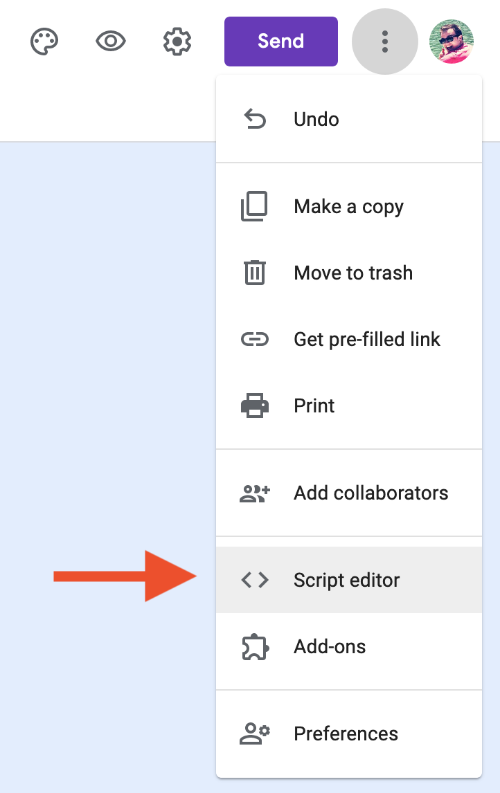

# How to use the Google Apps Script

1. Create a google form (or open an existing one in edit mode)
2. Click on the 3 dots in the upper right and select "Script Editor" 
3. Copy/paste [the code](./google-forms-to-chat-room.gs) into the editor. 
4. Paste in your `FORM_ID`, which is the long string of random alphanumeric characters and symbols in the url before the `/edit`
5. Change your `API_KEY` to your 8x8 API key.
6. Run the `setupTrigger()` function. This is necessary as a first step as it will propmpt you to accept permissions.
7. Enable the trigger `on submit` for your form. In the scripts editor click Edit > Current Projects Triggers > Add Trigger button (bottom right).
8. Fill out the form and see the message appear in the 8x8 chat room!
